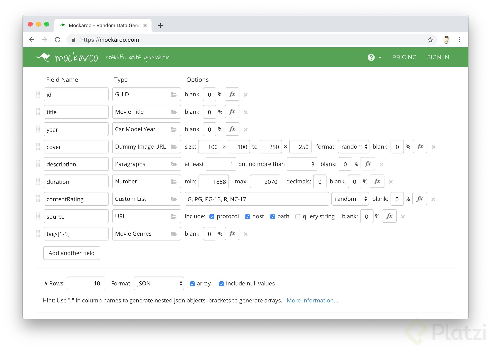
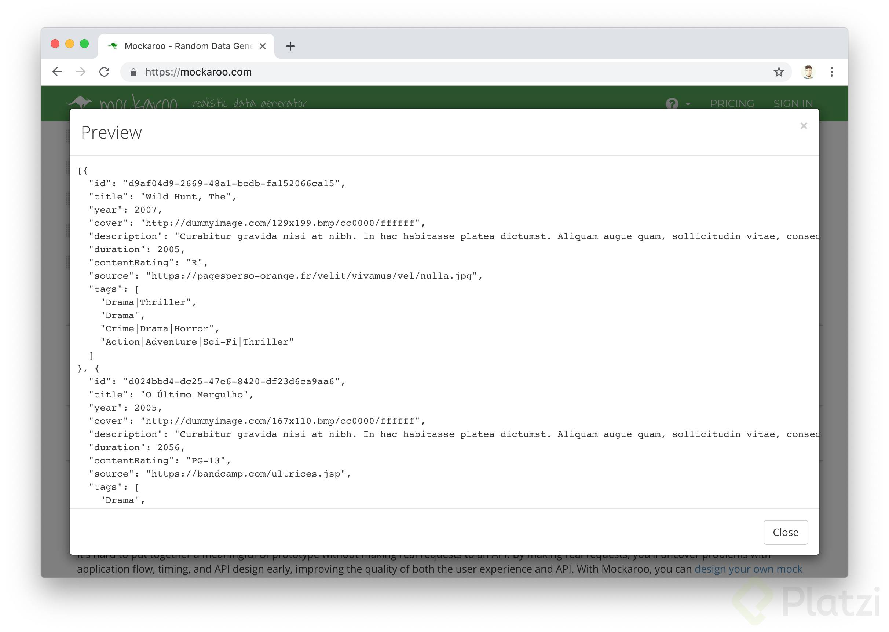
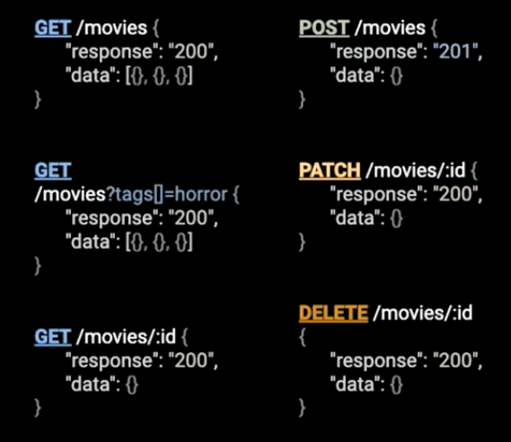
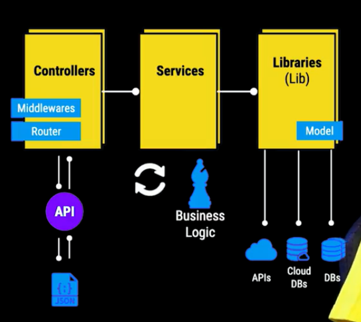
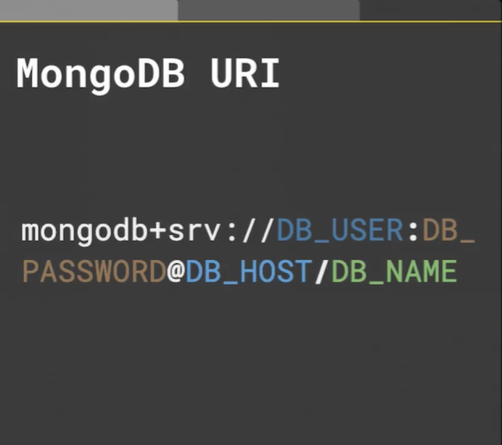
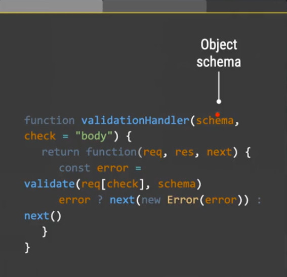

# Node

## ¿Qué es Node.js y para que sirve?

La definición formal de nodejs es: un entorno de ejecución para javascript construido con el motor v8.
**El entorno de ejecucíon:** es la capa que corre por el sistema operativo que ejecuta software, básicamente se ecnarga de como se consume memoria, como acceder a las variables y como corre el [garbage collector](https://es.wikipedia.org/wiki/Recolector_de_basura).

[V8]() Es un engine de Javascript por de chromiund-project para chrome y chromium. Además de chrome existen 2 proyectos que son chromium que es la versión open source y luego chrome canary, chrome canary se llamá así por una analogía donde antiguamente los mineros iban a la mina y para detectar si habia gases o algún peligro, ponían a un canario en una pequeña jaula, si había un gas y pasaba algo, el canario lasimosamente moría y es la manera en como se daban cuenta si había algún error, lo mismo pasa con chrome canary, es la manera como detectan errores y si todo sale bien, lo pasan a chrome.

Chrome V8 lo que hace es compilar javascript a código máquina. Recordemos que los lenguajes interpretados se ejecutan muy rápido, pero cuando hay un loop de código muy seguido se demoran, porque cada vez que pasan por esa linea de código tienen que volverla a interpretar a diferencia de los lenguajes compilados que se demoran mucho en cargar, porque tienen que pasar precismanete por ese proceso de compilación, luego se ejecutan muy rápido porque compilan esa linea, por eso cada vez que vuelven a pasar por ese loop, ya esta perfectamente compilado.

Javascript solía ser interpretado y ahora es compilado con una tecnologia llamada **Just in time compiler** ó [compilación en tiempo de ejecución](https://es.wikipedia.org/wiki/Compilaci%C3%B3n_en_tiempo_de_ejecuci%C3%B3n), está tecnología lo que tiene es un monitor que se encarga de revizar cada cuanto se ejecuta nuestro código, si el código se ejecuta mucho pone un estado warm y lo que hace es que ese código lo compila, si ese código compilado se ejecuta muchas veces, lo coloca en un estado HOT y es básicamente es hacerle una optimización a ese compilado, para que cuando se llame, ya llame a la versión optimizada.

Nodejs fue tomar el engine de JS chrome V8 para crear un entorno de ejecución y poder usar javascript del lado del servidor, recordemos que tenemos otros engine de JS como: [spiderMonkey]() [JavascriptCore]() [Chakra](). Pero como recientemente van a renovar la versión de Each van a empezar a implementar el motor V8 como Js engine.

## Fechas importantes de NodeJS

En 2009 por primera vez [Ryan Dahl](https://en.wikipedia.org/wiki/Ryan_Dahl) mostró al mundo nodejs.
En 2011 por primera vez Linkenlin usa nodejs en producción.
En 2013 se saca Gust que es una Plataforma de plugin.
A la vez Paypal saca un framework de nodejs llamado [Krakenjs](https://github.com/krakenjs/kraken-js)
En 2015 sale la competencia de nodejs llamada IOJS, pero afortunadamente se reconcilian y crean lo que hoy es [La Nodejs foundation](https://foundation.nodejs.org/).
En 2017 Nodejs Se vuelve Messing con un 8.8 millones de instancias funcionando.

## Diferencias entre NodeJs y Javascript

En Javascript tenemos el [DOM document object model]() es la interfaz que nos permite interpretar el documento html en javascript como lo es el objeto window, también tenemos el [CSSDOM]() que es la interfaz que nos permite manipular el css en javascript, por otro lado tenemos el [FetchAPI]() que por el cual podemos hacer request y que nos devuelva una promesa, también tenemos toda la capa de webstorage que consiste en el [sessionStorage] y el [localStorage] que eso no existe en nodejs, tenemos el modulo de canvas API que nos permite hacer gráficos en la web en 2D y 3D y apartir de ahi tenemos una seríe de APIS como lo son: el BluttudAPI, AudioAPI, webAutenthicationAPI.

Por otro lado en Nodejs tenemos una serie de modulos:
- Http: permite crear servidores 
- Sistema operativo: nos permite comunicarnos entre el sistema operativo y darnos información sobre el.
- Utilidades: que son una serie de utilidades excusivas para nodejs
- Debugger: una manera en la que podemos hacer debuggin con nodejs.
- Streams: nos permiten manejar grandes colecciones de datos-
- Eventos: podemos definir acciones y disparar más adelante 
- Ecmascript Modules: se pueden ejecutar en nodejs mediante un feature flag
- Consola: es muy similar a la del navegador

## Instalación de Node.js

Para instalar Node.js tienes que dirigirte [a](https://nodejs.org/es/) y elegir entre la ultima versión o la version LTS.

Por defecto Node.js detecta tu sistema operativo y descarga el archivo indicado para la instalación, si no es tu caso puedes dirigirte al enlace de otras [descargas](https://nodejs.org/es/download/.)

## Arquitectura orientada a eventos

Uno de los paradigmas de programación en nodejs más populares es la arquitectura orientada a eventos, los eventos nos permiten manipular el código asincrono de una mejor manera. Respasemos algunos ejemplos de callback

Concepto Error First Callback: cuando un callback tiene un error lo que vamos a enviar como primer párametro es el error.

Usando Callback
```js
const asyncCallback = function (cb) {
  setTimeout(() => {
    if (Math.random() < 0.5) {
      // Concepto Error First Callback: 
      return cb(null, 'Hola mundo');
    } else {
      cb(new Error('Hello Error'));
    }
  }, 2000)
}

asyncCallback((err, msg) => {
  // Verificar si existe el error
  if (err) {
    console.log('Error', err);
  } else {
    console.log('mensage', msg);
  }
})
```

Usando Promesas:
```js
// resolve: se encarga de resolver la promesa
// reject: se encarga de enviar un error en caso de que algo suceda
const promise = new Promise((resolve, reject) => {
  setTimeout(() => {
    if (Math.random() < 0.5) {
      // Concepto Error First Callback: 
      // En lugar de retornar un callback podemos llamar a Resolve
      // Como resolve ya no es Callback y ya no es Error First Callback, 
      //ya no hay necesidad de pasar Objeto null
      resolve('Hola mundo');
    } else {
      reject(new Error('Hello Error'));
    }
  }, 2000)
});

// Lo bueno de las promesas es que se pueden encadenar  
// Encadenamos el mensage para que antes de mostrarlo, se muestre en UpperCase
promise.then(msg => msg.toUpperCase())
  .then(msg => console.log('message', msg))
  .catch(err => console.log('Error', err));
```

Aún hay una mejor manera de hacer estó, lo importante de las promesas es que esto se empieza a generar un código en cascada que es dificil de leer con el tiempo, ahora recientemente se puede usar **async await** que es una manera de escribir código asincrono que se vea sincrono.

Lo que requiere async await es que nuestra función devuelva una promesa, que es como una serie de wrapper que hacemos, en esté caso nosotros vamos a convertir esa promesa en una función:

```js
const promiseFunction = () => new Promise((resolve, reject) => {
  setTimeout(() => {
    if (Math.random() < 0.5) {
      resolve('Hola mundo');
    } else {
      reject(new Error('Hello Error'));
    }
  }, 2000)
});

async function asyncAwait() {
  try {
    const msg = await promiseFunction();
    console.log('message', msg);
  } catch (error) {
    console.log('error', error);
  }
}

asyncAwait();
```

## Event Emiter

Hay una forma aún más poderosa de ejecutar el código anterior y es con la clase event-emitter. EventEmitter no es exclusivo, podemos usar promesas y código asincrono, pero ya vamos a ver cuales son sus ventajas:

```js
// Creamos un Event Emitter
const EventEmitter = require('events');

// Podemos crear un logger propio
class Logger extends EventEmitter {
  // Método execute recibe un callback
  execute(cb) {
    console.log('Before');
    // Emitimos un Evento 
    this.emit('start');
    cb();
    // Emitimos otro evento
    this.emit('finish');
    console.log('Afther');
  }
}

const logger = new Logger();

// Cada vez que ocurra algún evento, hagá algo
logger.on('start', () => console.log('STARTING'));
// Podemos Suscribirnos al evento multiples veces sin niguna restricción 
logger.on('finish', () => console.log('Finishing'));

logger.on('finish', () => console.log("It's Done"));

// logger.execute(() => console.log("Hello World"));

/*
Algo muy importante es que si ejecutamos código asincrono, como un setTimeout,
el orden no va ha permanecer, porque como es código asincrono precisamente se va 
ha ejecutar despues de todas las emisiones, en ese caso la manera de controlarlo es
usando callbacks, si lo ejecutamos veremos que nuestro hello world se ejecuta despues,
porque queda de manera asincrona.
*/
logger.execute(() => setTimeout(() => console.log("Hello World"), 500));
```

## Primer Servidor

En esta ocación tenemos que leer codígo e interpratar lo que se esta haciendo:

```js
const http = require('http');
const server = http.createServer();

// El servidor funciona con eventos
server.on('request', (request, response) => {
  // request: lo que llegá del request
  // response: lo que le vamos a responder al cliente
  response.statusCode = '200';
  response.setHeader('Content-Type', 'text-plain');

  response.end('hellow world\n')
});

server.listen(9000);
console.log('Servidor en la url http://localhost:9000');
```

Segundo Servidor que usa el evento POST para recibir datos e imprimirlos tal cúal:

```js
const http = require('http');
const server = http.createServer();

// El servidor funciona con eventos
// request: lo que llegá del request
// response: lo que le vamos a responder al cliente
// El Objeto request es un RewriteString
// Los strings heredan de los event Evimetter -> es decir también tiene eventos
server.on('request', (request, response) => {
  if (request.method === 'POST' && request.url == '/echo') {
    let body = [];
    request.on('data', chunk => {
      body.push(chunk);
    })  // Caundo recibe nuestros datos, hay un evento end 
      .on('end', () => {
      // Acá ya termino de recibir nuestros datos
      response.writeHead(200, { "Content-Type": "text-plain"});
      // En lugar de quemar la respuesta, responderemos con el cuerpo
        /* El string chunk tiene los datos de tipo buffer y lo que hay que hacer para que sea un string
          para que sea una cadena de texto en un string podemos usar la utilidad Buffer
        */
        body = Buffer.concat(body).toString();
      response.end(body)
    })
  } else {
    response.statusCode = 404;
    response.end();
  }

});

server.listen(9001);
console.log('Servidor en la url http://localhost:9001'); 
```

Servidor que recibe tu fecha de cunpleaños y devuelve el dia de la semana que nacieron:

```js
const http = require('http');
const server = http.createServer();
// My firts server by Jasan Hernández :)
const Days = ['Domingo', 'Lunes', 'Martes', 'Miercoles', 'Viernes', 'Sabado', 'Domingo'];
const Months = [
  'Enero', 'Febrero', 'Marzo', 'Abril', 'Mayo', 'Junio', 'Julio',
  'Agosto', 'Septiembre', 'Octubre', 'Noviembre', 'Diciembre'
];
// El servidor funciona con eventos
server.on('request', (req, res) => {
  if (req.method === 'POST' && req.url == "/send") {
    // Arreglo que guardara los chunks que le enviemos
    let body = [];
    req.on('data', chunk => {
      body.push(chunk);
      // Cuando terminamos de guardar nuestros datos hay un evento end
    })
      .on('end', () => {
      // Acá ya termino de recibir los chuks
        res.writeHead(200, { "Content-Type": "text-plain" });
        // En lugar de quemar la respuesta, responderemos con el cuerpo
        // Tenemos que parcear los datos que vienen de tipo Buffer
        body = Buffer.concat(body).toString();
        let result = body.split('/');
        let date = new Date(result[2], result[1] - 1, result[0]);
        let dateFormatt = `Naciste el día ${Days[date.getDay()]} 
        ${date.getDate()} de ${Months[date.getMonth()]} del año ${date.getFullYear()}`;

        res.end(dateFormatt);
    })
  } else {
    res.statusCode = 404;
    res.end('No Found');
  }
})

server.listen(8000);
console.log('Servidor en la url http://localhost:8000'); 
```

## Sreams 

Introducción:

Es una colección de datos tal como lo son los array y las cadenas de texto, solo que en vez, solo que en lugar de estar en su totalidad, se van manejando pedazo por pedazo, esto hace que los streams sean verdaderamente poderosos, porque podemos manejar gran cantidad de datos.

## Readable y Writable Streams

Los readable streams y writable streams tienen eventos y funciones, tienen eventos porque como bien sabemos heredan de la clase event emitter.

Readable
Eventos más comunes
- data: Se dispara cuando recibe datos.
- end. Se dispara cuando termina de recibir datos.
- error. Se dispara cuando hay un error.

Las funciones más comunes son:
- pipe
- unpipe
- read
- push

Writable 
Eventos más comunes:
- drain. Se dispara cuando emite datos.
- finish. Se dispara cuando termina de emitir.
- error. Se dispara cuando hay un error.

Las funciones más comunes son:
- write
- end

Recuerda que tienen estos eventos porque los heredan de la clase **EventEmitter**.

Writable straeams

```js
const { Writable } = require('stream');

const writableStream = new Writable({
  write(chunk, encoding, callback) {
    console.log(chunk.toString());
    callback();
  }
});

process.stdin.pipe(writableStream);
```

Readable streams
```js
const { Readable } = require('stream');
const readableStream = new Readable();

readableStream.push(`${0 / 0}`.repeat(10).concat("Batman, Batman!"));
readableStream.push(null);

readableStream.pipe(process.stdout)
```

Readable streams on demand
```js
const { Readable } = require('stream');
const readableStream = new Readable({
  read(size) {
    setTimeout(() => {
      if (this.currentCharCode > 90) {
        this.push(null);
        return;
      }
      this.push(String.fromCharCode(this.currentCharCode++));
    }, 200)
  }
});

readableStream.currentCharCode = 65; 
readableStream.pipe(process.stdout)
```

## Duplex y Transforms streams

Ambos sirven para simplificar nuestro código:

- Duplex: implementa los métodos write y read a la vez.
- Transform: es similar a Duplex pero con una sintaxis más corta.

Duplex
```js
const { Duplex } = require('stream');

const duplexStream = new Duplex({
  write(chunk, encoding, callback) {
    console.log(chunk.toString());
    callback();
  },
  read(size) {
    setTimeout(() => { 
      if (this.currentCharCode > 90) {
        this.push(null);
        return;
      }
  
      this.push(String.fromCharCode(this.currentCharCode++));
    }, 200);
  }
});

duplexStream.currentCharCode = 65;
process.stdin.pipe(duplexStream).pipe(process.stdout);
```

Transform
```js
const { Transform } = require('stream');

const transformStream = new Transform({
  transform(chunk, encoding, callback) {
    this.push(chunk.toString().toUpperCase());
    callback();
  }
});

const transformStreamCamelCase = new Transform({
  transform(chunk, encoding, callback) {
    this.push(
      chunk
        .toString()
        .toLowerCase()
        .split(' ')
        .map((e, index) => index > 0 ? e.charAt(0).toUpperCase() + e.substring(1) : e)
        .join('')
    );
    callback();
  }
});

process.stdin.pipe(transformStreamCamelCase).pipe(process.stdout);
```

## Uso de utilidades que tiene NodeJS

## Sistema operativo y sistemas de archivos

Utilidades del sistema operativo

```js
const os = require('os');

// método para conocer los cpus de nuestra maquina
console.log("CPU info", os.cpus());
// Conocer la ip de nuestra máquina.
// console.log("IP addrees", os.networkInterfaces().lo.map(i => i.address));

// Conocer la memoria libre de nuestro sistema
console.log("Free memory", os.freemem());

// Conocer tipo de sistema operativo tenemos
console.log("Type ", os.type());

// Conocer la versión
console.log("SO version", os.release());

// Imprimir la dirección del usuario
console.log("Usr info", os.userInfo());
```

Utilidades con el sistema de archivos

En node las utilidades la mayoria pueden funcionar de manera sincrona y asincrona, de manera sincrona, quiere decir que el va a esperar a hasta que se ejecuta ese proceso y hasta que no de una respuesta no va a continuar con la siguiente linea.

En node cuando se ejecuta de manera sincrona necesitamos usar callbacks porque es la manera en la que el sabe cuando ya terminamos, ejecute mi código que quiero procesar despues de que hizo todo lo que tenia que hacer esté modulo

Usando la **readFileSync** que lee los datos de manera sincrona.

```js
const fs = require('fs');

/*Cuando usamos la manera asincrona es muy recomendable usar un bloque
try catch porque es la manera en que podemos capturar un error
*/

try {
  // leer mi archivo
  // Con process.argv 'argumentos en vector' es poder leer lo que nosotros pasamos por la terminal
  const file = process.argv[2];

  // leer nuestro contenido
  const content = fs.readFileSync(file).toString();

  const lines = content.split('\n').length;
  console.log(lines);
} catch (err) {
  console.log(err);
  console.log("Necesitas especificar el archivo que quieres leer");
}
```

Vamos a hacer lo mismo de manera asincrona, pero esta vez no tenemos que especificar que es *readFileSync* sino que es simplemente **readFile**, porque por defecto Nodejs trata de ser asincrono.

```js
const fs = require('fs');

const file = process.argv[2];

if (!file) {
  throw new Error('Debes indicar el archivo que quieres leer');
}
// Como primer parametro recibe el archivo y como segundo parametro recibe el callback
// un callback es error first callback
const content = fs.readFile(file, (err, content) => {
  if (err) {
    console.log(err);
  }
  const lines = content.toString().split('\n').length;
  console.log(lines);
})
```

El modulo file system no solo nos permite leer archivos sino que en el también podemos crear carpetas, leer directorios, crear archivos, eliminar archivos, etc. Es todo lo que un usuario puede hacer con archivos y carpetas.

También podemos visitar la documentación de Nodejs 12.0 sobre [FileSystem]()

## Administrar directorios y archivos

Leer el nombre de los archivos que estan dentro de un directorio

```js
// leer cuales son los archivos que estan dentro de un directorio
const fs = require('fs');
// dirname: directorio actual
const files = fs.readdir(__dirname, (err, files) => {
  if (err) {
    console.log(err);
  }
  console.log(files);
})
```

Creamos directorios o carpetas con mkdir desde node

```js
// Creamos direcorios o carpetas.
const fs = require('fs');
fs.mkdir("ejemplo/documents/node", { recursive: true }, err => {
  if (err) {
    console.log(err);
  }
});
```

Copiar archivos con Nodejs

```js
const fs = require('fs');

// Primer parametro el archivo que queremos copiar
// Segundo parametro el archivo que queremos crear
fs.copyFile("naranja.txt", "limon.txt", err => {
  if (err) {
    console.log(err);
  }
  console.log("naranja.txt fue copiado como limon.txt");
})
```

## Consola, utilidades y debuggin

En nodejs tenemos la utilidad consola en ella podemos usar el console.info, console.log, console.error, estamos bastante familiarizados con esta utilidad sinn emabargo todo por defecto lo que imprimimos por consola se va por el **stdout** y todo lo que imprimimos en el console.error se va por el **stderror**. Mediante la clase consola que es diferente a la consola, podemos personalizarlo para decir que en vez se valla por el stdout o stderror, hagamos una cosa completamente diferente.

```js
// En lugar de usar una consola stdout o stderror
/* 
Usaremos el conocimiento de fileystem, para que cada vez que escriba o que imprimaa
El stdout nos quede un archivo de log.

Así mismo cada vez que usemos el stderror, creamos otro archivo log.
*/

const fs = require('fs');

// Cada vez que imprima en el stdout nos cree un archivo de log
const out = fs.createWriteStream("./out.log");
const err = fs.createWriteStream("./err.log");

/* creamos consola personalizada, la cual lo hacemos instanciando la Clase
Console la cual recibe 2 párametros, como primer parametro todo lo que le pasemos en el
console.log o console.info y como segundo párametro, todo lo que llamé con sonsole.error
*/
const consoleFile = new console.Console(out, err);

// Ejecutamos una función de intervalo cada 2 segundos
setInterval(() => {
  // Imprimimos una fecha en el console.log personalizado
  consoleFile.log(new Date());
  // Imprimimos un error en el console.error personalizado
  consoleFile.error(new Error("Ooops!"));
}, 2000)
```

No solo podemos jugar con la clase de la consola para crear nuestra consola personalizada, si no que también vamos a explorar diferentes utilidades de consola.

console.log por debajo trabaja con una utilidad llamada
  util format:
  
- %s: String
- %n: Número
- %j: json

Estos son pequeños placeholders para formatear nuestros datos.
``console.log("Un %s y un %s", "Perrito", "Gatito");``

Si accedemos a la consola de node exactamente esto hace la utilidad **util.format()** es decir la consola se alimenta del paquete util.format y funciona exactamente igual.

Node ocupa este paquete de utilidades para otros paquetes que el expone, pero nos deja la posibilidad de alimentarnos de estas utilidades, es decir si yo por alguna razón quiero hacer uso del util.format lo podemos hacer.

Alias de console.log:

- console.info

Alias de de console.error:
- console.wran

- console.assert: Si hay un error nos muestra que existe un error en un assert, en un booleano o verificación:

```js
console.assert(42 == "42");
console.assert(42 === 42);
```

- console.trace: nos inidica la linea donde esta ocurriendo el error que es mucho más especifico.

Una utilidad bastante interesante es una llamada de burlog, lo que tenemos que hacer obtener la utilidad, por la cual node nos la deja abierta para que la hagamos, e invocamos el debuglog, llamando **util.debuglog**. Esto es muy parecido a como funciona el paquete debug de express, pero nosotros básicamente lo que decimos es crear un debuggin.

Vamos a crear un nuevo debuggin  que va a exponer un namespace que va a ser _foo_ 
Nosotros podemos imprimir nuestro mensaje de debug "hello"y esto solo solo se imprime si pasamos la variable de entorno NODE_DEBUG con el namespace.

## Deprecate

Cuando hacemos util.deprecate hacemos un wrap de una función que ya está obsoleta y queremos hacer saber a nuestros usuarios que ya no deberia de usar, lo interesante de nuestra función deprecate es que nos permite imprimir un mensaje.

```js
const util = require("util");

const helloPluto = util.deprecate(() => {
  console.log("hello pluto");
}, 'pluto is deprecated. It is not a planet anymore');

helloPluto();
```

Esto es bastante util cuando nosotros estamos haciendo refactory y nosotros queremos hacerle saber al usuario que hay ciertas funcionalidades que quizas en una versión más adelante va a desaparecer por completo.

## Debuggin en node

Para hacer debuggin en node lo que debemos usar es el flag ``node --inspect`` y luego especificar al archivo que queremos hacer debuggin. En versiones anteriores de node es decir < 12, hacer uso de node debugg, genera un warning o deprecation warning que es exactamente igual al util-deprecate que aprendimos con anterioridad, esto quiero decir que en futuras versiones de node, esto va a desaparecer. Por lo que la recomendación es empezar a usar el node --inspect desde ahora.

Cuando hacemos el node inspect, el habre un puerto en el localhost:9229 especificado acá en nuestro navegador. Si nos damos cuenta es exactamente la utilidad debuggin que tiene js del lado del cliente.

## Clusters y procesos hijos

Una sola instancia de Node.js corre un solo hilo de ejecución. Para tomar ventaja de los sistemas con multiples core, necesitamos lanzar un cluster de procesos de Node.js para manejar la carga.

El módulo cluster nos permite la creación fácil de procesos hijos que comparten el mismo puerto del servidor. Veamos un ejemplo en código:

```js
const cluster = require("cluster");
const http = require("http");


// Requerimos la cantidad de CPUs que tiene la maquina actual
const numCPUs = require("os").cpus().length;


if (cluster.isMaster) {
  console.log(`Master ${process.pid} is running`);


  // Si el cluster es maestro, creamos tantos procesos como numero de CPUS
  for (let i = 0; i < numCPUs; i++) {
    cluster.fork();
  }


  // Si por alguna razón el cluster se finaliza hacemos un log
  cluster.on("exit", (worker, code, signal) => {
    console.log(`worker ${worker.process.pid} died`);
  });
} else {
  // Los diferentes workers pueden compartir la conexión TCP
  // En este caso es una servidor HTTP
  http
    .createServer((req, res) => {
      res.writeHead(200);
      res.end("hello world\n");
    })
    .listen(8000);


  console.log(`Worker ${process.pid} started`);
}
```

Si corremos nuestro archivo de Node.js ahora compartirá el puerto 8000 con los diferentes workers:

```js
$ node server.js
Master 3596 is running
Worker 4324 started
Worker 4520 started
Worker 6056 started
Worker 5644 started
```
En Windows, todavía no es posible establecer un nombre de proceso server en un worker.

Documentación Oficial de [NodeJs Cluster](https://nodejs.org/api/cluster.html)

## Request y Response Objects

El objeto ``req`` (Request) en Express representa el llamado HTTP y tiene diferentes propiedades del llamado, como la cadena de texto query (Query params), los parámetros de la URL (URL params), el cuerpo (Body), los encabezados (HTTP headers), etc.

Para acceder al ``req`` basta con acceder al primer parámetro de nuestros router handlers (router middleware) ó middleware.

Como por ejemplo así lo hemos visto siempre:

```js
app.get("/user/:id", function(req, res) {
  res.send("user " + req.params.id);
});
```

Pero también funcionaria sin problemas:

```js
app.get("/user/:id", function(request, response) {
  response.send("user " + request.params.id);
});
```

### Exploremos las propiedades más importantes

**req.body**

Contiene los pares de llave-valor de los datos enviados en el cuerpo (body) del llamado (request). Por defecto es ``undefined`` pero es establecido cuando se usa algún “body-parser” middleware como ``body-parser`` y ``multer``.

En Postman cuando hacemos un _request_ y enviamos datos en la pestaña **Body**, estos middlewares son los que nos ayudan a entender el tipo de datos que vamos a recibir en el ``req.body``.

Aquí podemos ver como se pueden usar estos middlwares para establecer el valor del ``req.body:``

```js
const app = require("express")();
const bodyParser = require("body-parser");
const multer = require("multer");
const upload = multer(); // Para datos tipo multipart/form-data

app.use(bodyParser.json()); // Para datos tipo application/json
app.use(bodyParser.urlencoded({ extended: true })); // Para datos tipo application/x-www-form-urlencoded

app.post("/profile", upload.array(), function(req, res, next) {
  console.log(req.body);
  res.json(req.body);
});
```

Más información sobre los diferentes formatos que puede tener el body: https://developer.mozilla.org/es/docs/Web/HTTP/Methods/POST

**req.params**

Esta propiedad contiene un objeto con las propiedades equivalentes a los parámetros nombrados en la ruta. Por ejemplo, si tenemos una ruta de la forma ``/user/:name`` entonces la propiedad ``name`` está disponible como ``req.params.name`` y allí podremos ver su valor. Supongamos que llamaramos a la ruta con /user/glrodasz, entonces el valor de ``req.params.name`` sería ``glrodasz``. Este objeto por defecto tiene el valor de un objeto vacío ``{}``.

```js
// GET /user/glrodasz
req.params.name;
// => "glrodasz"
```

**req.query**

Esta propiedad contiene un objeto con las propiedades equivalentes a las cadenas de texto query de la ruta. Si no hay ninguna cadena de texto query tendrá como valor por defecto un objeto vacío ``{}``.

```js
req.query.q;
// => "tobi ferret"

// GET /shoes?order=desc&shoe[color]=blue&shoe[type]=converse
req.query.order;
// => "desc"

req.query.shoe.color;
// => "blue"

req.query.shoe.type;
// => "converse"
```

Más información sobre los query strings en: https://es.wikipedia.org/wiki/Query_string y https://tools.ietf.org/html/rfc3986#section-3.4

**Response Object**

El objeto ``res`` representa la respuesta HTTP que envía una aplicación en Express.

Para acceder al ``res`` basta con acceder al segundo parámetro de nuestros router handlers (router middleware) o middleware.

Como por ejemplo así lo hemos visto siempre:

```js
app.get("/user/:id", function(req, res) {
  res.send("user " + req.params.id);
});
```

Pero también funcionaría sin problemas:

```js
app.get("/user/:id", function(request, response) {
  response.send("user " + request.params.id);
});
```

### Exploremos los métodos más comunes

**res.end()**

Finaliza el proceso de respuesta. Este método viene realmente del core de Node.js, específicamente del método ``response.end()`` de ``http.ServerResponse``.

Se usa para finalizar el request rápidamente sin ningún dato. Si necesitas enviar datos se debe usar ``res.send()`` y ``res.json()``.

```js
res.end();
res.status(404).end();
```

**res.json()**

Envía una respuesta JSON. Este método envía una respuesta (con el content-type correcto) y convierte el parámetro enviado a una cadena de texto JSON haciendo uso de ``JSON.stringify()``.

El parámetro puede ser cualquier tipo de JSON, incluido un objeto, un arreglo, una cadena de texto, un boolean, número, null y también puede ser usado para convertir otros valores a JSON.

```js
res.json(null);
res.json({ user: "tobi" });
res.status(500).json({ error: "message" });
```

**res.send()**

Envía una respuesta HTTP. El parámetro ``body`` puede ser un objeto tipo _Buffer_, una cadena de texto, un objeto, o un arreglo. Por ejemplo:

```js
res.send(Buffer.from("whoop"));
res.send({ some: "json" });
res.send("<p>some html</p>");
res.status(404).send("Sorry, we cannot find that!");
res.status(500).send({ error: "something blew up" });
```

## ¿Qué es express y para que sirve?

Express.js es un framework para crear [Web Apps](https://es.wikipedia.org/wiki/Aplicaci%C3%B3n_web), [Web APIs](https://es.wikipedia.org/wiki/Web_API) o cualquier tipo de [Web Services](https://es.wikipedia.org/wiki/Servicio_web), es libre bajo la licencia MIT.

Express es muy liviano y minimalista además de ser extensible a través de Middlewares.

Los Middlewares interceptan el request y el response para ejecutar una acción en medio.

Fechas importantes:

En el 2014 de express fueron adquiridos por una compañia llamada [StrongLoop]
En septiembre 2015 [IBM] adquirio StrongLoop
En enero del 2016 IBM anunció que express iba a ser dirigido por la [NodeJs Foundation]()

Caracterisiticas de express

- Minimalista
- Template Engines
- Routing
- Middlewares
- Plugins (como middlewares)


## Crea tu primer servidor en express

empezaremos creando una carpeta llamada movies-api, aquí es donde vamos a construir todo el backend de nuestro proyecto.

Para comenzar un proyecto en express lo más recomendable es generar un package.json 

```npm init o npm init -y``

Vamos a crear algunos scripts que nos serviran durante el desarrollo:

``"dev": "DEBUG=app:* nodemon index"``
``"start": "NODE_ENV=production node index"``

- DEBUG=app*: La variable de entorno debug me imprima todo lo que tenga el namespace de la aplicación.
- nodemon: Nos permite que cada vez que hagamos un cambio en el servidor refresque automaticamente, de está manera no tengo que estar bajando y subiendo el código.

- NODE_ENV=producction: Arrancar el proyecto en modo producción.
- node index: arrancamos el proyecto con nodejs.

Como queremos usar una configuración de [eslint]() bien interesante lo que vamos a hacer es crear un archivo *.eslintrc.json* con la siguiente configuración: 

```json
{
  // Todo mi código va a usar la versión de Ecmascript 2018 en adelante
  "parserOptions": {
    "ecmaVersion": 2018
  },
  // Vamos a extender la configuración de eslint recomendada y vamos a usar
  // una configuración compatible con prettier.
  "extends": ["eslint:recommended", "prettier"],
  "env": {
    // Vamos a usar variables de entorno de EcmaScript 6
    "es6": true,
    // Vamos a usar variables de entorno de Node
    "node": true,
    // Vamos a usar variables de entorno moca ¿Por qué?
    // Cuando lleguemos a la hora de hacer testsi utilizamos unas variables globales
    // eslint nos puede sacar un error, pero aqui le estamos especificando que son variables de moca
    "mocha": true
  }, 
  "rules": {
    // La regla de no-console: no va ha ser un error si no un warning 
    // porque aveces necesitamos dejarlo
    "no-console": "warn"
  }
}
```

Por otro lado vamos a configurar nuestro Prettierrc.json. [Prettier]() es una configuración muy interesante que nos permite formatear nuestro código es decir: Muchas veces hay problemas cuando un desarrollador formatea el código de una manera y otro desarrollador formatea el código de otra manera, esto suele ser bastante confunso y suele ser una perdida de tiempo en los call-review. **Prettier** se encargá de que todos los desarrolladores a la hora de hacer commit de su código sea igual, en este ejemplo pondremos algunas reglas, pero cada quien puede acomodarlo a su gusto.

```json
{
  "tabWidth": 2,
  "semi": true,
  "singleQuote": true
}
```
Teniendo esta configuración base lo que vamos a hacer es empezar a instalar nuestras dependencias: **express** para crear nuestro servidor también **dotenv**: sirve para cargar nuestras variables de entorno.

Ahora vamos a instalar nuestras dependencias de desarrollo, estás dependencias a diferencia de las de producción, son dependencias que solo vamos a manejar acá, cuando nosotros desplegamos nuestra aplicación a producción no instalamos nuestras dependencias de desarrollo, esto hace que el código sea más liviano en producción.

devDependencies:

``npm i -D nodemon eslint eslint-config-prettier eslint-plugin-prettier prettier``

Finalmente para que nuestro código haga el formateo automático cada vez que se hace commit y se sube al repositorio, vamos a instalar un hook, esto se instala solo mediante un comando que vamos a ver a continuación:

``npx mrm lint-staged``

Con esto el lint-staged automáticamente modifica nuestro packages.json y le dice mira cada vez que hagas un commit, vamos a coger todo el código y lo vamos a formatear con la configuración que hemos establecido de eslint y prettier, y lo vamos a subir nuestro repositorio.

Vamos a crear un nuevo archivo de configuración, es recomendable abstraerlo porque si el día de mañana estamos cargando nuestras variables de entorno de otra manera podemos hacerlo rápidamente haciendo el cambio solo a nuestro archivo de configuración, en esté caso vamos a hacer uso de [dotenv], más adelante vamos a entender que es, pero por ahora solo crearemos un archivo de configuración muy sencillo.

```js
require('dotenv').config();

const config = {
  dev: process.env.NODE_ENV !== 'production',
  port: process.env.PORT || 3000
}

module.exports = { config };
```

Ahora vamos a crear nuestro servidor en express

```js
const express = require('express');
const app = express();

const { config } = require('./config/index');

// Cuando hagamos un request a nuestra aplicación, nos imprima un hello world
app.get('/', (req, res) => {
  res.send("Hello world");
})

app.get('/json', (req, res) => {
  res.json({hello: 'world'});
})

app.listen(config.port, function () {
  console.log(`Listening http://localhost:${config.port}`);
})
```

Challenge: Crear un servidor que detecte si el año es bisiesto:

```js
const express = require('express');
const app = express();

// Cuando hagamos un request de tipo GET 
app.get('/', (req, res) => {
  // Lo que vamos a enviar a pantalla
  res.send("Envianos el año en la url escribiendo '/año'");
})

app.get('/:year', (req, res) => {
  const year = req.params.year;
  if (year % 4 === 0 && year % 100 !== 0) {
    res.send(`El ${year} Es bisiesto`);
  } else {
    res.send(`Lo siento el año ${year} no es bisiesto :(`);
  }
})

app.listen(2000, function () {
  console.log('Litening http://localhost:2000');
})
```

## Anatomía de una API Restful

Rest: que significa representational state transfer (rest) es un estilo de arquitectura para construir web services, no es un standart pero si existe una especificación creada por [Roy Fielding](https://es.wikipedia.org/wiki/Roy_Fielding) el es el confundador de apache server y director de Apache Software fundation también actualmente trabaja como director de adobe.

Las peticiones HTTP van acompañadas de un “verbo” que define el tipo de petición:

- GET. Lectura de datos.
- PUT. Reemplazar datos.
- PATCH. Actualizar datos en un recurso específico.
- POST. Creación de datos.
- DELETE. Eliminación de datos.

No es recomendable habilitar un endpoint de tipo PUT y DELETE para toda nuestra colección de datos, sólo hacerlos para recursos específicos, ya que no queremos que por error se puedan borrar todos nuestros datos.

## Estructura de una película con Mockaroo

[Mockaroo](https://mockaroo.com/) es un servicio que nos permite crear datos simulados a partir de una estructura, por ejemplo para generar la estructura de nuestra película:

```json
{
    id: 'd2a4a062-d256-41bb-b1b2-9d915af6b75e',
    title: 'Notti bianche, Le (White Nights)',
    year: 2019,
    cover: 'http://dummyimage.com/800x600.png/ff4444/ffffff',
    description:
      'In hac habitasse platea dictumst. Etiam faucibus cursus urna. Ut tellus.',
    duration: 66,
    contentRating: 'G',
    source: 'https://ovh.net/semper/rutrum/nulla/nunc.jsp',
    tags: [
      'Action|Adventure',
      'Action|Adventure|Thriller',
      'Horror|Western',
      'Horror|Thriller',
      'Comedy|Romance|Sci-Fi',
      'Adventure|Animation|Children|Comedy|Fantasy',
      'Drama'
    ]
  }
```

Lo que podemos hacer en Mockaroo es seleccionar la siguiente estructura:

<div align="center">
  
</div>

Luego seleccionamos el número de filas (rows) que queremos generar y elegimos el formato, en este caso será de tipo JSON. Podemos hacer clic en preview para ver cómo queda y finalmente para descargar los datos hacemos clic en **Download Data**.

<div align="center">
  
</div>

## Implementando un CRUD en expres.js

CRUD viene de las siglas: create read updated and delete esto significa crear, leer, actualizar y eliminar.

Nosotros vamos a obtener las rutas mediante el verbo GET. A continuación se muestran las rutas que vamos a ocupar para trabajar:

<div align="center">
  
</div>

Ahora vamos a implementar un crud en nuestro código:

Para crear una ruta necesitamos de express pues es quien nos define el router, luego vamos a usar en esté caso un archivo de mocks, los mocks son archivos falsos, de datos falsos, pero más adelante vamos a aprender cuando nos conectemos con servicios y como conectarnos a la base de datos para traer archivos reales, en este ejemplo lo estamos haciendo, porque lo que nos interesa ahora es entender como se definen las rutas y esos archivos de mocks nos van a servir más adelante para escribir test y verificar.  

```js
/**
 * Para crear una ruta necesitamos de express pues es quien nos define el router
 */
const express = require("express");
const { moviesMock } = require();

/** vamos a recibir una aplicación de express, lo que nos permite ser dinamicos y obtener el control,
 * sobre que aplicación va a consumir nuestra ruta.
*/

function moviesApi(app) {
  // creamos el router
  const router = express.Router();
  // le decimos a la aplicación que le vamos a pasar como parametro le vamos a decir la ruta de inicio
  app.use("/api/movies", router)

  // Apartir de aqui lo que hacemos es alimentar el router con las otras rutas
  // Cuando se le asigna un get al home, y el home va a ser api/movies, que fue el que definimos arriba

/* nos va a devolver las salidas, como estamos escribiendo código asincrono debemos usar la palabra
   clave async, recuerden que una ruta recibe el request, el response object y en este caso vamos a 
   recibir la funcionalidad next, esto hace parte de la teoria de middleware que vamos a explicar 
   más adelante
*/
  router.get("/", async function (req, res, next) {
    // como es código asincron es muy importante utilizar el try catch
    try {
      // es importante que como nuestro codigo es un await debemos envolverlo
      // en una promesa para que puedamos hacer uso de nuestro código asincrono con la palabra await
      const movies = await Promise.resolve(moviesMock);

      // Usamos response, definimos el estatus, que como hablamos con anterioridad va a ser 200 de ok
      // definimos su estructura json
      res.status(200).json({
        data: movies,
        message: 'movies listend'
      })
    } catch (error) {
      next(error);
    }
  })
}

// Ahora tenemos que exportarla, porque aquí estamos definiendo la ruta pero no la estamos usando
// en nuestra aplicación de express

module.exports = moviesApi;
```

Ahora nos vamos a nuestro archivo index, removemos las rutas de ejemplo que creamos con anterioridad, e importamos nuestra ruta, como es una función debemos ejecutarla y pasarle nuestra aplicación de express.

Con esto sería suficiente, pero es muy importante crear nuestro archivo de mocks, usamos una aplicación que se llama mockroo que nos ayuda a crear mocks fácilmente de una estructura.  

El archivo de mocks estará disponible en este repositorio.

## Métodos idempotentes del CRUD

Acabamos de ver como podemos listar las peliculas, ahora lo que vamos a ver es el resto de métodos de ``CRUD``, para eso vamos a mirar el código.

Como vemos en el siguiente coódigo los método del CRUD tienen una estrucutura muy similar, para eso vamos a copiar el método get 4 veces y le haremos algunas modificaciones

```js
/**
 * Para crear una ruta necesitamos de express pues es quien nos define el router
 */
const express = require("express");
const { moviesMock } = require("../utils/mocks/movies");

/** vamos a recibir una aplicación de express, lo que nos permite ser dinamicos y obtener el control,
 * sobre que aplicación va a consumir nuestra ruta.
*/

function moviesApi(app) {
  // creamos el router
  const router = express.Router();
  // le decimos a la aplicación que le vamos a pasar como parametro le vamos a decir la ruta de inicio
  app.use("/api/movies", router)

  // Apartir de aqui lo que hacemos es alimentar el router con las otras rutas
  // Cuando se le asigna un get al home, y el home va a ser api/movies, que fue el que definimos arriba

  /* nos va a devolver las salidas, como estamos escribiendo código asincrono debemos usar la palabra
     clave async, recuerden que una ruta recibe el request, el response object y en este caso vamos a 
     recibir la funcionalidad next, esto hace parte de la teoria de middleware que vamos a explicar 
     más adelante
  */
  router.get("/", async function (req, res, next) {
    // como es código asincron es muy importante utilizar el try catch
    try {
      // es importante que como nuestro codigo es un await debemos envolverlo
      // en una promesa para que puedamos hacer uso de nuestro código asincrono con la palabra await
      const movies = await Promise.resolve(moviesMock);

      // Usamos response, definimos el estatus, que como hablamos con anterioridad va a ser 200 de ok
      // definimos su estructura json
      res.status(200).json({
        data: movies,
        message: 'movies list'
      })
    } catch (error) {
      next(error);
    }
  })

  // Obtener movie por id
  router.get("/:movieId", async function (req, res, next) {
    try {
      const movies = await Promise.resolve(moviesMock[0]);
      res.status(200).json({
        data: movies,
        message: 'movies retrieved'
      })
    } catch (error) {
      next(error);
    }
  })

  // create
  router.post("/", async function (req, res, next) {
    try {
      const createdMovieId = await Promise.resolve(moviesMock[0].id);
      res.status(201).json({
        data: createdMovieId,
        message: 'movie created'
      })
    } catch (error) {
      next(error);
    }
  })

  // PUT - actualizar
  router.put("/:movieId", async function (req, res, next) {
    try {
      const updatedMovieId = await Promise.resolve(moviesMock[0].id);
      res.status(200).json({
        data: updatedMovieId,
        message: 'movie updated'
      })
    } catch (error) {
      next(error);
    }
  })

  // delete
  router.delete("/:movieId", async function (req, res, next) {
    try {
      const deleteMovieId = await Promise.resolve(moviesMock[0].id);
      res.status(200).json({
        data: deleteMovieId,
        message: 'movies deleted'
      })
    } catch (error) {
      next(error);
    }
  })

}
// Ahora tenemos que exportarla, porque aquí estamos definiendo la ruta pero no la estamos usando
// en nuestra aplicación de express

  module.exports = moviesApi;
```

Antes de continuar ya que es un buen momento para hacer commit, me gustaría hablar de algo que se llama el gitignore, es un archivo de configuración que le dice a git que archivos no debemos compartir, hay archivos inecesarios como node_modules entre otras, que no tiene sentido compartirla con las demás, pues esos archivos se generan por el sistema operativo o por carpeta o por usuario. La herramienta de [ignore.io](http://gitignore.io/) me permite definir precisamente esos hambientes, como nuestro proyecto es de node vamos a seleccionar ese tag, y como no sabemos quien va a poder usar esté proyecto, podemos agregar las 3 sistemas operativos, windows, mac y linux.


## Implementando una capa de servicios en express

Está aquitectura es una versión simplificada de [Clean Architecture](https://translate.google.com/translate?hl=&sl=en&tl=es&u=https%3A%2F%2Fblog.cleancoder.com%2Funcle-bob%2F2012%2F08%2F13%2Fthe-clean-architecture.html)

<div align="center">
  
</div>

¿Por que la comparto o la recomiendo?

Porque MVC que es la arquitectura tradicional a la que estamos acostumbrados, se queda corta en las aplicaciones modernas, no nos basta solo con tener: modelo, vista y controlador. Entonces lo que nosotros definimos en una aplicación en express: **los controladores que son toda la capa de middlewares y el router** que se comunican con la API y reciben o envían JSON, luego temos una capa de servicios, aquí es muy importante porque aquí es el corazón de nuestra aplicación, aquí es donde está toda la logica de negocio y es importante saber que **los controladores NO llaman a otros controladores** los controladores **solo llaman servicios**. Pero los servicios si pueden llamar otros servicios o llamar librerias, las librerías son la capa que esta adjunta a librerias externas, como por ejemplo: bases de datos, bases de datos que estan en la nube o incluso otras API. 

Diferentes razones y opiniones sobre porque dejar de usar MVC:

- [Cleand coder](https://blog.cleancoder.com/uncle-bob/2012/08/13/the-clean-architecture.html)
- [Ryan Florence](https://www.youtube.com/watch?v=kp-NOggyz54)
- [Laravel no es mvc](https://styde.net/porque-laravel-no-es-mvc-y-tu-deberias-olvidarte-de-mvc/)
- [Twitt sobre mvc por founder de Laravel](https://twitter.com/taylorotwell/status/262290285499936768)

Ahora vamos a ver como implementar [Clean Architecture ](https://translate.google.com/translate?hl=&sl=en&tl=es&u=https%3A%2F%2Fblog.cleancoder.com%2Funcle-bob%2F2012%2F08%2F13%2Fthe-clean-architecture.html) en nuestro código

Implementación de la capa de servicios:

```js
const { moviesMock } = require("../utils/mocks/movies");

class MoviesService {
  async getMovies() {
    const movies = await Promise.resolve(moviesMock);
    return movies || [];
  }

  async getMovie() {
    const movie = await Promise.resolve(moviesMock[0]);
    return movie || {};
  }

  async createMovie() {
    const createMovieId = await Promise.resolve(moviesMock[0].id);
    return createMovieId || {};
  }

  async updateMovie() {
    const deletedMovieId = await Promise.resolve(moviesMock[0].id);
    return deletedMovieId;
  }

}

module.exports = MoviesService;
```

Implementación de CRUD en express:

```js
const express = require("express");
const MoviesServices = require('../services/movies');

function moviesApi(app) {
  const router = express.Router();
  app.use("/api/movies", router);

  const moviesService = new MoviesServices();

  router.get("/", async function (req, res, next) {
    const { tags } = req.query;
    try {
      const movies = await moviesService.getMovies({ tags });

      res.status(200).json({
        data: movies,
        message: 'movies list'
      })
    } catch (error) {
      next(error);
    }
  })

  // Obtener movie por id
  router.get("/:movieId", async function (req, res, next) {
    const { movieId } = req.params;
    try {
      const movies = await moviesService.getMovie({ movieId });
      res.status(200).json({
        data: movies,
        message: 'movies retrieved'
      })
    } catch (error) {
      next(error);
    }
  })

  // create
  router.post("/", async function (req, res, next) {
    const { body: movie } = req;
    try {
      const createdMovieId = await moviesService.createMovie({ movie })
      res.status(201).json({
        data: createdMovieId,
        message: 'movie created'
      })
    } catch (error) {
      next(error);
    }
  })

  // PUT - actualizar
  router.put("/:movieId", async function (req, res, next) {
    const { movieId } = req.params;
    const { body: movie } = req;
    try {
      const updatedMovieId = await moviesService.updateMovie({ movieId, movie })
      res.status(200).json({
        data: updatedMovieId,
        message: 'movie updated'
      })
    } catch (error) {
      next(error);
    }
  })

  // delete
  router.delete("/:movieId", async function (req, res, next) {
    try {
      const deleteMovieId = await Promise.resolve(moviesMock[0].id);
      res.status(200).json({
        data: deleteMovieId,
        message: 'movies deleted'
      })
    } catch (error) {
      next(error);
    }
  })

}
// Ahora tenemos que exportarla, porque aquí estamos definiendo la ruta pero no la estamos usando
// en nuestra aplicación de express

  module.exports = moviesApi;
```

## Creación de una BD en MongoAtlas

En este modulo aprenderemos como podemos conectarnos a servicios externos en Express.js gracias a la arquitectura que implementamos donde tenemos nuestras rutas, nuestros servicios y librerías, podemos conectarnos a cualquier servicio o cualquier base de datos externa de una manera muy sencilla.

En está ocación vamos a usar Mongo Atlas para conectarnos a una instancia de MongoDB, mongodb es un sistema de base de datos no relacional, los llamados NO-SQL _not only sql_.

Para esta ocación vamos a hacer uso de nuestras variables de entorno, de está manera por cada enviroment, vamos a usar diferentes configuraciones, es decir en desarrollo vamos a conectarnos a una instancia o podríamos fácilmente conectarnos a una instancia local, en stagin el enviroment de pruebas o en producción deberíamos usar diferentes bases de datos.

La uri de **mongodb** tiene está estructura.

<div align="center">
  
</div>

Donde necesita el 
- usuario de base de datos
- el host
- el nombre

Todo esto lo vamos a representar en variables de entorno para que a la hora de cambiar de hambiente, sea muy fácil de remplazarlo, te voy a mostrar como podemos conectarnos en el código.

1. Crear una cuenta en [Mongo Atlas](https://www.mongodb.com/cloud/atlas)
2. Podemos hacer click en start free o try free, ambos nos llevan al mismo formulario para crear nuestra instancia gratuita
3. Vamos a llenar el formulario con: email, nombre y apellido, para el password recomendamos un administrador de contraseñas y recomendamos [lastpast](https://www.lastpass.com)
4. Nos pide aceptar terminos y condiciones
5. Podemos elegir cualquier provedor entre: Amazon web services, google cloud o Azure
6. En este caso eligiremos Amazon
7. Despues nos inidica cuales de las regiones tienen la disponibilidad de crear una instancia gratuita, vamos a dejar la que tiene por defecto.
8. Despues nos muestra una configuración que tiene por defecto y podemos simplemente darle en create cluster.

Mientras que mongodb crea el cluster podemos revisar ciertas configuraciones como por ejemplo: el Network Access, Mongo Atlas limita el acceso a las bases de datos. Lo que se debe hacer cuando estemos en producción es determinar cual es la ip de la máquina que esta en producción para que solo esa IP tenga acceso a nuestra bases de datos, como en está ocación estamos hablando de desarrollo, nosotros vamos a permitir que cualquier IP se conecte a nuestra base de datos.

Permitir que se conecte cualquier IP no es tan grave porque de todas maneras necesitamos el usuario y contraseña, pero es muy buena práctica restringir las conexiones por IP.

Vamos a configurar el Network Access y vamos a indicarle que nos deje acceder desde cualquier parte, confirmamos y el crea el registro.

Otra cosa que debemos hacer si nuestra base de datos ya está lista, es crear un usuario en Database Access, en está ocación vamos a elegir a un usuario que solo puede leer y escribir en nuestra base de datos

Ejemplo de user:

``db_user_platzivideos``

``7Puyn0l6TnOw``

Finalmente vamos a revizar si el cluster se está creando, normalmente toma un tiempo porque lo interesante de mongodb atlas a diferencia de otros servicios, es que el crea unas replicas, un cluster se compone de 3 instancias de mongodb, estó hace qu tengamos alta disponibilidad a diferencia de otros servicios, entonces vamos a esperar un momento a que termine de crear nuestra instancia de mongo.

Una vez creada debemos tomar los datos de conexión, para esto le damos en connect en cualquiera de las opciones nos proporciona la uri que debemos usar, que es muy similar a la imagen que mostramos con aterioridad. Lo único que nos falta para complementar nuestra uri es la base de datos. 

Para esto nos vamos a collecctions, en el nos dice las bases de datos que tenemos en esté caso son 0, y lo que le vamos a decir es **Add my own data**, en el podemos dar un nombre a la base de datos, en esté caso la vamos a llamar *platzivideos_db* y el nombre de la colleccion va a ser *Movies*, la creamos y estamos listos para poder ingresar nuestra uri en el código.

## Conexión a MongoAtlas una instancia de MongoDB

Ya que tenemos nuestra cuenta en mongodb atlas nos disponemos a crear la conexión en nuestra apliación.

1. instalar el paquete ``npm i mongodb``
2. Vamos a crear 2 archivos: ``.env.example`` y el archivo ``.env``

El archivo .env.example es necesario para que cualquier otro desarrollador que tome nuestro proyecto sepa que variables de entorno debe alimentar localmente, mientras que el archivo .env van a ser las variables de entorno y va a ser alimentada por el archivo de configuración, esté nunca debe ser subido a base de datos, porque si no estamos exponiendo nuestras credenciales y cualquiera que tenga acceso al repositorio podría tomarlas, ya se han problemas por situaciones como está.

```js
# CONFIG
PORT=3000
CORS=*


# MONGO
DB_USER=
DB_PASSWORD=
DB_HOST=
DB_NAME=
```

Ahora lo que hace falta es alimentar nuestro archivo de configuración con estás variables de entorno, lo que vamos a hacer es ir a nuestro archivo .env.example y copiar las variables de entorno, ir a nuestro archivo de configuración y agregarlas, las copiamos del env.examples para no borrar los valores y que fuera más sencillo.

archivo de configuración:
```js
require('dotenv').config();

const config = {
  dev: process.env.NODE_ENV !== 'production',
  port: process.env.PORT || 3000,
  cors: process.env.CORS,
  dbUser: process.env.DB_USER,
  dbPassword: process.env.DB_PASSWORD,
  dbHost: process.env.DB_HOST,
  dbName: process.env.DB_NAME
};

module.exports = { config };
```

Ya nuestro archivo de configuración tiene estas nuevas variables de entorno, entonces lo que vamos a hacer así como hemos echo con nuestra capa de rutas y nuestra capa de servicios, es crear una capa de librerías, en esté caso crearemos una carpeta que se llamará **lib**

En el lo que vamos a requerir es el cliente de mongo, eso lo hacemos ya con la **librería** que instalamos con anterioridad que es **mongodb** está librería es la oficial para conectarse a mongo, luego traemos nuestro archivo de configuración porque es desde ahí donde vamos a construir nuestra uri.

```js
const { MongoClient, ObjectId } = require('mongodb');
const { config } = require('../config');

// aquí vamos a crear las diferentes constantes
// encodeURIComponent nos garantizá que si por alguna razón hay algunos caracteres especiales
// no tengamos problemas a la hora de conectarnos.
const USER = encodeURIComponent(config.dbUser);
const PASSWORD = encodeURIComponent(config.dbPassword);
const DB_NAME = config.dbName;

// Ahora ya podemos comenzar a escribir nuestra uri de mongo
const MONGO_URI = `mongodb+srv://${USER}:${PASSWORD}@${config.dbHost}:${config.dbPort}/${DB_NAME}?retryWrites=true&w=majority`;
// mongodb+srv://db_user_platzivideos:<password>@cluster0-nnl4g.mongodb.net/test?retryWrites=true&w=majority
class MongoLib {
  constructor() {
    this.client = new MongoClient(MONGO_URI, { useNewUrlParser: true });
    this.dbName = DB_NAME;
  }

  connect() {
    // Usamos patron Singleton: la idea es que cada vez que nos conectemos a nuestra base de datos
    // no nos cree un nuevo cliente. Si no que si el cliente ya está y la conexión ya esta abierta, usemos esa misma conexión
    if (!MongoLib.connection) {
      MongoLib.connection = new Promise((resolve, reject) => {
        this.client.connect(err => {
          if (err) {
            reject(err);
          }

          console.log('Connected succesfully to mongo');
          resolve(this.client.db(this.dbName));
        });
      });
    }

    return MongoLib.connection;
  }
}
```

## Implementación de las acciones de MongoDB

Las acciones son básicamente lo que es compatible con el CRUD:

<div align="center">
  
</div>

Documentación de mongo:

- [Collection Methods](https://docs.mongodb.com/manual/reference/method/js-collection/)
- [MongoDB CRUD operations](https://docs.mongodb.com/manual/crud/)
- [Mongo introduction Book](https://github.com/uokesita/the-little-mongodb-book/blob/master/es/mongodb.markdown)

Implementaremos nuestros las acciones con Mongo:

```js
class MongoLib {
  constructor() {
    this.client = new MongoClient(MONGO_URI, { useNewUrlParser: true });
    this.dbName = DB_NAME;
  }
// Todos necesiatan retornas el método connect, y connect lo que nos retorna es una promesa
  // nos devuelve una instancia a la base de datos y esa instancia de la bd tiene los métodos de mongo.
  getAll(collection, query) {
    return this.connect().then(db => {
      return db
        .collection(collection)
        .find(query)
        .toArray();
    });
  }
  get(collection, id) {
    return this.connect().then(db => {
      return db.collection(collection).findOne({ _id: ObjectId(id) });
    });
  }
  create(collection, data) {
    return this.connect()
      .then(db => {
        return db.collection(collection).insertOne(data);
      })
      .then(result => result.insertedId);
  }
  updated(collection, id, data) {
    return this.connect()
      .then(db => {
        return db
          .collection(collection)
          .updateOne({ _id: ObjectId(id) }, { $set: data }, { upsert: true });
      })
      .then(result => result.updsertdId || id);
  }
  delete(collection, id) {
    return this.connect()
      .then(db => db.collection(collection).deleteOne({ _id: ObjectId(id) }))
      .then(() => id);
  }
}
```

Ya que hemos implementado nuestras acciones en la librería de mongo, en nuestra capa de servicios podemos remover los mocks, usar directamente está librería y así tener persistencia en la base de datos.

## Conexión de nuestros servicios con MongoDB

Ya que implementaste las acciones en la librería de mongo, nos vamos a disponer a coger la capa de servicios, remover los mocks e implementar esa librería y en está ocación ya tendremos persistencia de datos.

```js
const MongoLib = require('../lib/mongo');

class MoviesService {
  constructor() {
    this.collection = 'movies';
    this.mongoDB = new MongoLib();
  }
  async getMovies({ tags }) {
    const query = tags && { tags: { $in: tags } };
    const movies = await this.mongoDB.getAll(this.collection, query);
    return movies || [];
  }

  async getMovie({ movieId }) {
    const movie = await this.mongoDB.get(this.collection, movieId);
    return movie || {};
  }

  async createMovie({ movie }) {
    const createMovieId = await this.mongoDB.create(this.collection, movie)
    return createMovieId || {};
  }

  async updateMovie({ movieId, movie } = {}) {
    const updateMovie = await this.mongoDB.updated(this.collection, movieId, movie);
    return updateMovie;
  }

  async deletedMovie({ movieId }) {
    const deletedMovieId = await this.mongoDB.delete(this.collection, movieId);
    return deletedMovieId;
  }


}

module.exports = MoviesService;
```

Si vamos a crear un registro por medio de [postman]() cuando hacemos el send, vamos a tener un error y es porque el aún no saber como leer los datos que le estamos pasando, por defecto express necesita parcear estos datos JSON. La manera de corregirlo es agregando un Middleware desde el index.js

```js
const express = require('express');
const app = express();

const { config } = require('./config/index');
const moviesApi = require('./routes/movies.js');

// middleware de bodyparser
app.use(express.json());
moviesApi(app);

// Cuando hagamos un request a nuestra aplicación, nos imprima un hello world
app.get('/', (req, res) => {
  res.send("Hello world");
})

app.get('/json', (req, res) => {
  res.json({hello: 'world'});
})

app.listen(config.port, function () {
  console.log(`Listening http://localhost:${config.port}`);
})
```

Una vez funcionando nos damos cuenta que nuestro servicio está siendo persistente con la base de datos.


## ¿Qué es un middleware?

Un middleware es una pieza de software que está en medio de otras 2, se le suele describir como software glue, es decir pegamento de software y es porque nos ayuda a conectar otras piezas de software, pensemos por un momento en la población y en el agua, que es un recurso natural, si queremos que esté recurso natural llegue a la población deberíamos insertar en el medio en esté caso un middleware que sería un sistema de tuberias, el sistema de tuberías nos permite conectar el agua a la población, pero nosotros podemos seguir agregando middlewares, podemos agregar un middleware que se encargue de purificar el agua y luego podríamos poner otro middleware que se encargue de contar el consumo del agua.

En express especificamente, la manera en como funcionan los middlewares es mediante la firma del: request-object, response-object y la funcionalidad next.

<div align="center">
 
</div>

nosotros hemos visto algo muy similar en nuestro código: el req, res y la funcionalidad next, lo que nos permite es que en el middleware podemos hacer cualquier ejecución de código, podemos modificar el request-object, podemos modificar el response-object y la manera en como llamamos al siguiente middleware es a travez de la funcionalidad next, si por alguna razón le pasamos un párametro a la funcionalidad next, se ejecutan los middlewares de error.

Nosotros lo que vamos a hacer como ejemolo del mundo real es, crear toda una capa de manejo de errores de un middleware, pero los middleware en next del formato err, tienen una firma diferente, y es que en vez de recibir los 3 páramtros, van a recibir un cuarto párametro que va a ser el error, de está manera podemos maniuplar el error y decir como lo imprimimos y llamar el next con un error o no para saber si llamamos nuestro siguiente middleware de manejo de error, te voy a enseñar como puedes hacerlo en tu código:

1. En nuestra carpeta de utilidades vamos a crear una nueva carpeta que se llamará middleware.
2. Creamos un archivo llamado errorHandlers.js
3. Vamos a traer nuestro archivo de configuración porque dependiendo si estamos en modo desarrollo o modo producción, quiero que el error que nos imprima incluya el stack del error o no, recuerda que el stack es toda la configuración relaciona al error.
4. Crearemos una funcion que va a ser nuestro middleware que se encargará de imprimir nuestros errores, el cual recibe: **err, req, res, next**
5. El otro middleware que vamos a crear es que nos va a ayudar a darle manejo al error, por defecto express, como imprime los errores es en formato html, como nosotros estamos implementando una api lo más necesario es que sean en formato JSON.
6. Para poder determinar si agregamos el stack o no es crear otra función de ayuda, esto no es un middleware que se llamará *withErrorStack*, en ella vamos a recibir: **err, stack** 

```js
const { config } = require('../../config/index');

function withErroStack(err, stack) {
  if (config.dev) {
    return {
      err,
      stack
    };
  }
  return err;
}

function logErrors(err, req, res, next) {
  console.log(err);
  next(err);
}

function errorHandler(err, req, res, next) { // eslint-disable-line
  res.status(err.status || 500);
  res.json(withErroStack(err.message, err.stack));
}

module.exports = {
  logErrors,
  errorHandler
};
```

Ahora vamos a ir a nuestro index y así como agregamos nuestro middleware del bodyParser, podemos agregar los otros middlewares.

```js
const express = require('express');
const app = express();

const { config } = require('./config/index');
const moviesApi = require('./routes/movies.js');

const { logErrors, errorHandler } = require('./utils/middleware/errorHandlers')

// middleware de bodyparser
app.use(express.json());

moviesApi(app);

// Los middlewares de error, siempre tienen que ir al final de las rutas, 
// las rutas también son middlewares
app.use(logErrors);
app.use(errorHandler);


// Cuando hagamos un request a nuestra aplicación, nos imprima un hello world
app.get('/', (req, res) => {
  res.send("Hello world");
})

app.get('/json', (req, res) => {
  res.json({hello: 'world'});
})

app.listen(config.port, function () {
  console.log(`Listening http://localhost:${config.port}`);
})
```

De está manera podemos implementar una capa del manejo de errores usando un middleware en express, a continuación dejaremos una lectura de las capas de manejo de errores, en ella no solo sabrás como implementar la capa de manejo de errores para código asincrono, sino también para código sincrono.

## Manejor de erroes asíncronos y síncronos en Express

El manejo de errores en Express es el proceso de capturar un error de manera asíncrona como síncrona . Por defecto Express viene con un manejador de errores por defecto, así que no es necesario escribir uno para empezar a usarlo.

Los errores que ocurren de manera síncrona dentro un manejador de rutas o un middleware no requieren trabajo extra. Si un código síncrono lanza un error Express automáticamente capturará el error. Por ejemplo:

```js
app.get("/", function(req, res) {
  throw new Error("BROKEN"); // Express capturara este error por sí solo.
});
```
Para errores que se retornan desde funciones asíncronas invocadas desde un manejador de ruta o un middleware, es necesario pasar el error como argumento a la función next(), de esta manera Express capturará el error y lo procesará. Por ejemplo:

```js
app.get("/", function(req, res, next) {
  fs.readFile("/file-does-not-exist", function(err, data) {
    if (err) {
      next(err); // Se debe pasar el error a Express.
    } else {
      res.send(data);
    }
  });
});
```
Es responsabilidad de nosotros capturar errores que puedan ocurrir en código asíncrono invocado desde un manejador de ruta o middleware para que Express lo procese. Por ejemplo:

```js
app.get("/", function(req, res, next) {
  setTimeout(function() {
    try {
      throw new Error("BROKEN");
    } catch (err) {
      next(err);
    }
  }, 100);
});
```
El ejemplo de arriba usa un bloque ``try...catch`` para capturar los errores en el código asíncrono y pasarlo a Express. Si el bloque ``try...catch`` fuese omitido, Express no podría capturar el error debido a que no es parte de un manejador síncrono de código.

Cuando se usan funciones que retornan promesas, puedes simplemente proveer la funcionalidad next al final del manejador catch de la promesa y Express automáticamente capturará el error. Por ejemplo:

```js
app.get("/", function(req, res, next) {
  Promise.resolve()
    .then(function() {
      throw new Error("BROKEN");
    })
    .catch(next); // Errores serán pasados a Express.
});
```

## Capa de validación de datos a travéz de un middleware

La capa de validación es necesaria porque cuando estamos consumiendo nuestros endpoints, los endpoints no saben que datos le estamos enviando, si estamos enviando en el caso de una pelicula con titulo o sin titulo, o a la hora de recibir las peliculas el formato del id es correcto, entonces mediante esta middleware podemos validar o podemos especificar unos schemas, de tal manera que podemos especificar que: la pelicula sea de tipo string, queremos que la numeración sea de tipo número, etc. De está manera si por alguna razón el cliente o el usuario ingrese los datos que no son, podemos especificar un error mostrando que partes son requeridas o que partes no tienen el formato, estó le va ha ayudar al cliente o al usuario a que se de cuenta como debe consumir nuestras API.

Para ello vamos a crear una funcionalidad que se va a llamar validationHandler, está funcionalidad va a recibir un schema, el esquema va a determinar cúal es el formato del esquema que vamos a enviar, como segundo párametro le vamos a informar donde queremos checar este esquema, por defecto vamos a checar el body del request, pero también podríamos checar los párametros o el query, etc. 
Cuando tenemos estos datos en la función retornamos una función que tiene la firma de un middleware, cogemos una utilidad que vamos a llamar validate, en esté caso le vamos a pasar en el req**[check]** checando el body, y le vamos a pasar un schema y esto puede que devuelva o no un error de validación, si devuelve un error, lo que vamos a hacer es llamar a nuestra funcionalidad next con el error. Acuerdence que cuando llamos a nuestra funcionalidad next con un párametro, en esté caso el error, van a empezar a ejecutarse los middlewares de error, si no simplemente llamos a nuestra funcionalidad next y como no le estamos pasando ningun párametro va a llamar al siguiente middleware 

<div align="center">
  
</div>

## ¿Qué es Join y Boom?

Join y Boom son tecnologías del ecositema de hapijs pero son tan buenas, que las vamos a integrar como middleware en nuestra aplicación de express.

Join: Object schema validation, es la librería que nos va a ayudar a validar los schemas.
Boom: HTPP-friendly error objects. Es un manjeador de errores de una manera mucho más comprensible.

La mejor manera de entenderlos es visitando su documentación oficial.

- [Join](https://hapi.dev/family/joi/)
- [Boom](https://hapi.dev/family/boom/?v=8.0.1)

## Implementando Boom 

En esta sección aprenderemos a como podemos implementar Boom en nuestro código de express. Lo que haremos será usar boom en nuetros errorsHandlers que definimos con anterioridad, también aprovecharemos para crear nuestro error 404 de tal manera que cuando hagan un request a un endpoint que no existe, respondamos correctamente, te mostraré como hacerlo en el codigó.

1. primero necesitamos instalar Boom ``npm i @hapi/boom``
2. Nos diponemos a ir a nuestro middleware manejador de errores, en el vamos a incluir la dependecia de boom. 
```js
const boom = require('@hapi/boom');
```
3. Como ya nos va a llegar un error boom, vamos a hacer un sprint-operator al error porque ahora el error no solo trae el mensaje, si no que trae unas propiedades como vimos, el **error, statusCode y message**, entonces es necesario hacer esté pequeño cambio 
4. Crearemos un tercer middleware que se llamará **wrapErrors()** porque es posible que en algún punto el error que nos llegué no sea de tipo boom y nosotros queremos que apartir de ahí todos los errores tengan la estructura boom.
```js
function wrapErrors(err, req, res, next) {
  // Es posible que el error que nos llegue no sea de tipo Boom,
  // nosotros queremos que apartir de ahi todos los errores tengan la estructura boom
  if (!err.isBoom) {
    next(boom.badImplementation(err));
  }
  // Si el error que estamos pasando por acá es de tipo boom, 
  // llamamos al siguiente middleware con el error
  next(err);
}
```
5. Ahora apartir del error que ya va a ser de tipo boom, debemos sacar el outpu:
```js
function errorHandler(err, req, res, next) { // eslint-disable-line
  // Apartir del error que ya va ha ser de tipo boom debemos sacar el output, 
  // es la manera como le da menejo boom y ahoi podemos sacar el status code del error y el payload
  const { output: { statusCode, payload } } = err;
  // ahora no necesitamos manejar error.status, sino simplemente statusCode
  res.status(statusCode);
  // acá en lugar de pasar el error message pasamos el payload  
  res.json(withErroStack(payload, err.stack));
}
```
6. Ahora tenemos que exportar wrapErrors
7. Ahora lo que debemos hacer es actualizar nuestro archivo index el middleware, en esté caso lo que debemos hacer es ponerlo antes errorHandler.
8. Otra cosa que debemos hacer es ir al validationHandler y donde estabamos devolviendo un error, es devolver un error de Boom
```js
// Para devolver un error de Boom, requerimos boom
const boom = require('@hapi/boom');
/*
....
*/
function validationHandler(schema, check = "body") {
  return function (req, res, next) {
    const error = validate(req[check], schema);
    // Estó nos va a devolver un error de que los datos no son validos
    error ? next(boom.badRequest(error)) : next();
  }
}
```

También vamos a crear un middleware para menejar los erroes 404, el cual vamos a llamar notFoundHandler.

```js
const boom = require('@hapi/boom');

function notFoundHandler(req, res) { // eslint-disable-line
  const { output: { statusCode, payload } } = boom.notFound();

  res.status(statusCode).json(payload);
}
```
Está función es un middleware pero no recibe el next, porque para que pueda funcionar, lo más importante es que estó debe ir al final de las rutas, el notFound lo que hace es que se ejecuta cuando ya paso por todas las rutas

Ahora solo lo requerimos en nuestro archivo index y lo agregamos al final de las rutas.

```js
// routes
moviesApi(app);

// Catch 404
app.use(notFoundHandler);
```

Ahora si intentamos hacer una llamada con una ruta inexistente nos marcará el error 404 de Boom.

## Implementando Joi

En esté modulo vamos a implementar joi con nuestra capa de validación de datos.

1. Necesitamos instalar joi como una dependencia ``npm i @hapi/joi``
2. Vamos a ir a nuestro middleware de validationHandler.
3. Vamos a requerir joi. Recuerdan que teniamos la funcionalidad validate retornando false, ahora la vamos a implementar.
```js
const joi = require('@hapi/joi');

//* validate va a recibir la data que va a validar, y va a recibir un schema
function validate(data, schema) {
  // vamos a obtener un error en caso de que el schema no sea valido con la data
  // ANTIGUA IMPLEMENTACIÓN DE JOIN
  // const { error } = joi.validate(data, schema);

  // NUEVA IMPLEMENTACIÓN DE JOI ahora el schema valida la data
  const { error } = schema.validate(data, { errors: { stack: true } });
  return error;
}
```
4. Ahora lo que debemos de hacer es crear el schema para nuestros datos, en esté caso vamos a crear un schema que valide la estrucutura de nuestras peliculas, como recuerdan en nuestro mock teniamos una serie de atributos, como el titulo, año, cover, etc. Entonces lo que debemos de hacer es crear un schema que por ejemplo: 
  - A la hora de escribir un string tenga cierto tamaño o cierto minimo de tamaño y lo mismo para el resto de atributos.
  - Si vamos a ocupar en la duration numeros, tenemos que asegurarnos que sean números.
  - Si vamos usar una url debemos asegurarnos que sea una url.
5. Para ello en nuestras utilidades vamos a crear una nueva carpeta que se a llamar schemas, para guardar nuestros esquemas.

```js
const joi = require('@hapi/joi');

// llamamos join.string para indicar que es un string
/**
 * llamamos regex porque los ids de mongodb tienen cierta estructura y es una muy buena
 * forma de validarlo mediante un regex, porque son una collection de caracteres alphanumericos
 * que tienen un minimo de 24 caracteres.
 * 
 * /^[0-9]: inicia con cualquiera de los caracteres alphanumericos del 0 al 9
 * /^[0-9a-fA-F]: de la a minuscula a la f minuscula, y de la A mayuscula a la F mayúscula
 * /^[0-9a-fA-F]{24}$/: puede tener un tamaño de 24 y así es com debe terminar.
 */

const movieIdSchema = joi.string().regex(/^[0-9a-fA-F]{24}$/);
const movieTitleSchema = joi.string().max(80);
const movieYeartSchema = joi.number().min(1888).max(2077);
const movieCoverSchema = joi.string().uri();
const movieDescriptionSchema = joi.string().max(300);
const movieDurationSchema = joi.number().min(1).max(300);
const movieContentRatingSchema = joi.string().max(5);
const movieSourceSchema = joi.string().uri();
const movieTagsSchema = joi.array().items(joi.string().max(50))

const createMovieSchema = {
  title: movieTitleSchema.required(),
  year: movieYeartSchema.required(),
  cover: movieCoverSchema.required(),
  description: movieDescriptionSchema.required(),
  duration: movieDurationSchema.required(),
  contentRating: movieContentRatingSchema.required(),
  source: movieSourceSchema.required(),
  tags: movieTagsSchema
};

// Solo vamos a actualizar una parte de la pelicula
const updateMovieSchema = {
  title: movieTitleSchema,
  year: movieYeartSchema,
  cover: movieCoverSchema,
  description: movieDescriptionSchema,
  duration: movieDurationSchema,
  contentRating: movieContentRatingSchema,
  source: movieSourceSchema,
  tags: movieTagsSchema
}

module.exports = {
  movieIdSchema,
  createMovieSchema,
  updateMovieSchema
}
```

Ahora lo que debemos hacer es aplicar estos esquemas en nuestras rutas, para ello debemos ir a nuestras routes movies, y lo primero que debemos hacer es importar los schemas.

Inicialmente para el GET no le vamos a aplicar ninguna regla de validation, pero para el GET cuando recibe un id, es decir el especifico si lo vamos a hacer, primero traer nuestro validationHandler el cual también debemos de requerir.

Recuerden que nuestro validationHandler va a recibir un schema y también va a recibir de donde va a sacar los datos, por defecto va a sacarlo del body, pero en el caso del getMovieId lo vamos a sacar de los parametros porque el id viene de los parametros.

```js
 router.get("/:movieId", validationHandler(joi.object({ movieId: movieIdSchema }), 'params'), async function (req, res, next) { 
  //  .......
 }
```

Muy similar va ha ser para el post, el post en esté caso en vez de usar los parametros en esté caso va ha sacar del body, y va a sacar el *createMovieSchema* fijense que el middleware lo vamos a poner entre la ruta y entre la definición de la ruta y así mismo nosotros podemos poner varios middleware como es el caso del PUT.

```js
 // create
  router.post("/", validationHandler(joi.Object(createMovieSchema)), async function (req, res, next) {
    // ....
  }
```

Porque el PUT no solo recibe el párametro si no que también recibe el cuerpo, primero podría validar el cuerpo y segundo podría validar el id, pero primero validaremos el id, aunque cualquiera de los 2 funciona en esté caso, que debería de venir en los párametros id y en el body debería venir la pelicula, en esté caso no es createMovie, sino seria updatedMovie.

```js
// PUT - actualizar
  router.put("/:movieId", validationHandler(joi.Object({ movieId: movieIdSchema }), 'params'), validationHandler(updateMovieSchema) ,async function (req, res, next) {
    // ....
  }
```

## Middlewares populares en Express.js

A continuación te compartiré una lista de los middlewares más populares en Express.

**Body parser**

Analiza los cuerpos de las solicitudes entrantes en un middleware antes que los manejadores de ruta disponibles bajo la propiedad ``req.body``.

http://expressjs.com/en/resources/middleware/body-parser.html

**CORS**

Middleware para habilitar CORS (Cross-origin resource sharing) en nuestras rutas o aplicación.

http://expressjs.com/en/resources/middleware/cors.html

**Morgan**

Un logger de solicitudes HTTP para Node.js.
http://expressjs.com/en/resources/middleware/morgan.html

**Helmet**

Helmet nos ayuda a proteger nuestras aplicaciones Express configurando varios encabezados HTTP. ¡No es a prueba de balas de plata, pero puede ayudar!
https://github.com/helmetjs/helmet

**Express Debug**

Nos permite hacer debugging de nuestras aplicaciones en Express mediante el uso de un toolbar en la pagina cuando las estamos desarrollando. https://github.com/devoidfury/express-debug

**Express Slash**

Este middleware nos permite evitar preocuparnos por escribir las rutas con o sin slash al final de ellas. https://github.com/ericf/express-slash

**Passport**

Passport es un middleware que nos permite establecer diferentes estrategias de autenticación a nuestras aplicaciones. https://github.com/jaredhanson/passport

Puedes encontrar más middlewares populares en el siguiente enlace:
http://expressjs.com/en/resources/middleware.html

## Debugging e inspect

### Haciendo debugging

Para aprovechar por completo la funcionalidad de debugging que implementa Express, lo que recomiendo es cambiar todos los ``console.log`` por ``debug`` haciendo uso de un namespace de la siguiente forma:

```js
const debug = require("debug")("app:server");
debug("Hello debug");
```

De esta manera si ejecutamos nuestra aplicación con el comando ``DEBUG=app:* node index.js`` nos mostrará los diferentes logs.

De esta manera si ejecutamos nuestra aplicación con el comando DEBUG=app:* node index.js nos mostrará los diferentes logs.

Los namespaces que recomiendo son los siguientes:

- app:server para todo lo relacionado con el inicio del servidor como el mensaje ``Listening on http://localshost``
- app:db para todo lo relacionado con logs de las bases de datos, inicialización y ejecución de scripts.
- app:error para todo lo relacionado con errores en nuestra aplicación.

Nótese que esta convención es opcional, es decir, tu puedes seleccionar cualquier namespace. Lo más importante es que sea el mismo que se pasará en la opción **DEBUG**.

Express.js por defecto ya trae unos logs de debugging por defecto los podemos activar mediante la variable de entorno ``DEBUG=express:*``.

Por lo que recomiendo los scripts en nuestro archivo ``package.json`` de la siguiente manera:

```json
  "scripts": {
    "dev": "DEBUG=express:*,app:* nodemon index",
    "debug": "DEBUG=express:*,app:* npm run start",
  },
```

### Ejecutando el modo inspect en desarrollo

El modulo ``inspect`` de Node.js nos permite ejecutar un ambiente para hacer debugging de código haciendo uso de la consola de desarrolladores de Google. Para ejecutarlo en modo desarrollo con ``nodemon`` basta con agregar el flag ``--inspect`` por lo que recomiendo el siguiente script en nuestro archivo ``package.json``

```json
  "scripts": {
    "inspect": "DEBUG=express:*,app:* nodemon --inspect index"
  },
```

### Creación de test para nuestros endpoints

En esté modulo aprenderemos a crear test con nodejs, la primer suit de test que vamos a crear es para nuestros endpoints que están úbicados a la capa de rutas, su única responsabilidad de test es probar que le llegan los datos y devuelven los datos correspondientes, vamos a ver como se hace en el código.

1. Lo primero es instalar nuestras dependencias para los test 
``npm i -D mocha supertest sinon proxyquire``
- **mocha**: es quien nos ayuda a correr los test.
- **supertest**: es una utilidad que nos ayuda a levantar un servidor temporal.
- **sinon** es una utilidad que nos ayuda a hacer mocks para test 
- **proxyquire**: es una utilidad que nos ayuda a inyectar los mocks cuando requeramos los paquetes.

2. Antes de proceder con los test vamos a hacer una pequeña modificación en movies mocks. No solo teniendo estos mocks que nos van a hacer utiles para los test, voy a crear una pequeña utilidad, la cual nos ayudará a crear las peliculas filtradas.

Como nuestro objetivo es hacer test de las rutas, nosotros nunca vamos a hacer que llegue hasta los servicios. Solo vamos a testear las rutas, y eso lo vamos a hacer con **sinon** y **proxyquire**.

```js
function filteredMoviesMock(tag) {
  return moviesMock.filter(movie => movie.tags.includes(tag));
}
```

Luego vamos a crear un Mock de nuestros servicios, lo que hace esté mock es que cada vez que llamemos a getMovies() va a retornar la promesa que sería el Mock de las peliculas.

```js
class MoviesServicesMock {
  async getMovies() {
    return Promise.resolve(moviesMock);
  }
}
```

Y vamos a hacer un mock de método createMovie, y va a retornar la primera pelicual de nuestro MoviesMock 

```js
class MoviesServicesMock {
  // ...
  async createMovie() {
      return Promise.resolve(moviesMock[0]);
    }
}
```

Y exportamos ambas utilidades:

```js
module.exports = {
  moviesMock,
  filteredMoviesMock,
  MoviesServicesMock
};
```

3. El próximo pasa va a ser en nuestra carpeta de utilidades crear un test server, esté test es un server que su única misión va a ser levantar un server para pruebas. Los Test siempre se deben correr independientes del server original y más porque en esté caso no queremos levantar todo lo que tienen nuestro server, solo queremos un server muy pequeño que nos ayude a probar.

```js
const express = require('express');
const supertest = require('supertest');

// va a recibir una ruta
function testServer(route) {
// creamos una nueva app
  const app = express();
  // ha está app le vamos a pasar la ruta.
  route(app);
  // retornamos supertest y envolvemos nuestra app.
  return supertest(app);
}

module.exports = testServer;
```

Con estó ya tenemos lo necesario para empezar a crear nuestros test, entonces vamos a crear una carpeta que se llamé test y en esté caso como queremos hacer test a las rutas se va a llamar routes.movies.test.js, es buena práctica que esté archivo finalice en **.test.js** 

```js
// obtenemos el assert que es el que se encargá de verificar si es verdad o no nuestra
// comparación en los test
const assert = require('assert');
// Proxyquire lo que nos permite es que cada vez que hagamos un require
// podemos elegir que en vez de que nos traega el paquete real, nos traega un mock
const proxyquire = require('proxyquire');

// Traemos los mocks porque son los que nos van ayudar a verficar que esté funcionando
// correctamente.
const { moviesMock, MoviesServicesMock } = require('../utils/mocks/movies');
// necesitamos el testServer para correr nuestro server.
const testServer = require('../utils/testServer');

// Describimos nuestros test con la palabra describe, esto es lo que va a imprimir la consola
// la cual recibe como callback una función, en esté caso vamos a hacer los test del get de las movies
describe('routes - movies', function () {
  // Para poder probar los test de las movies necesitamos obtener la ruta que vamos a probar
  // en esté caso nuestra ruta será intervenida por proxyquire, que va ser la ruta de las movies
  // Lo que vamos a hacer es que ese archivo que nos llega de rutas, el cúal tiene una dependencia
  // nuestro servicio real, nosotros no queremos que cuando estemos llamando nuestras rutas
  // que llame nuestros servicios, porque el objetivo de estos test es que las rutas hagan su trabajo
  // ya más adelante haremos una prueba directa a los servicios
  const route = proxyquire('../routes/movies', {
    // La inclusión de esté servicio como está escrita allá, será remplazada por MoviesServicesMock
    '../services/movies': MoviesServicesMock
    // Es decir, cada vez que llamemos la ruta, quien va a servir de los Servicios es MoviesServiceMock
  });

  // creamos un request que va ser pasando testServer y le pasamos está ruta.
  // Aquí lo que estamos haciendo es usando nuestro testServer y lo único que estamos cargando
  // es está única ruta, así hacemos que el test sea especifico para esa ruta.

  const request = testServer(route);

  // teniendo estó ya podemos definir la situación que sería 
  describe('GET - /movies', function () {
    // debería responder con un status 200, recibe un callback con el done, 
    // que es para indicar cuando finalize el test
    it('should respond with status 200', function (done) {
      // aquí es donde hacemos nuestro assert, hacemos un request gracias a supertest
      // exactemente que cuando llamos a nuestra api, y llamamos expect(200, done)
      request.get('/api/movies/').expect(200, done);
    });
  });
});
```

Ahora vamos a hacer una pequeña prueba corriendo esté test, par ello lo que vamos a hacer es configurar un script donde podamos correr los test.

Esté test llamará a mocha y como esta en la carpeta de test y los archivos finalizan en **.test.js** debería ser capaz de leerlos sin problema, y si nos damos cuenta nuestro test está pasando sin problema.

Vamos a escribir otro test, esté test que vamos a escribir, es el test que nos va edificar que responda con la lista de peliculas.

```js
// test que nos responde con la lista de las peliculas, el truco está que nosotros debemos 
    // asegurar que nuestras rutas estén devolviendo los datos como deberían ser, 
    it('should respond with the list of movies', function (done) {
      // acá cambia un poco la manera en como lo hacemos, porque sería igual, la misma petición 
      // pero en vez de llamar el expect, finalizamos está petición, la cual tiene un callback,
      // que recibe un error-first y  el response
      request.get('/api/movies/').end((err, res) => {
        // acá llamamos al assert, el cual debería ser exactamente igual 
        // queremos corroborrar cual fue la respuesta del body, debería traer las movies
        assert.deepEqual(res.body, {
          // debería ser igual a data y el mensaje
          data: moviesMock,
          message: 'movies listed'
        });

        // done sirve para que el test se de cuenta, cuando finalizo, como estó
        //  tiene un callback tenemos que decirle que el test finalizo acá
        // si no lo pasamos el test nuca sabra cuando finaliza y le dara un timeout.
        done();
      }) 
    });
```

Si volvemos a correr nuestros test y funcionará bien si los mensajes de los test son iguales a de las rutas.

Los Test son muy importante hacerlos en el código, porque si en un futuro hacen cambios, el test nunca se rompa, por ejemplo si en un futuro por alguna razón, llegarán y sin ninguna intención, cambiarán el mensaje que sería un error, si corremos nuestros test nos van a fallar y nos va a decir que no es exactamente igual. 
**Los test son una buena manera de poder asegurar que nuestro código tiene calidad y que si en el futuro hay cambios, no se va a poder romper nuestro código**. 


